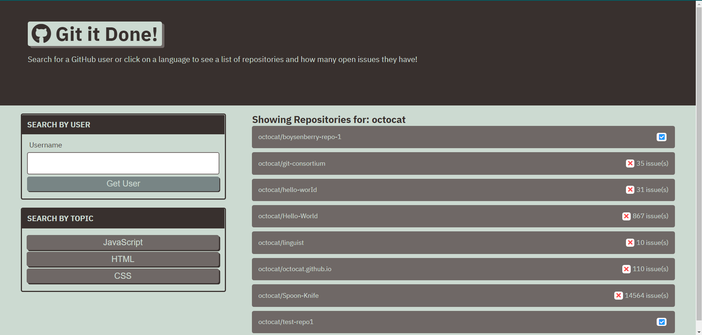
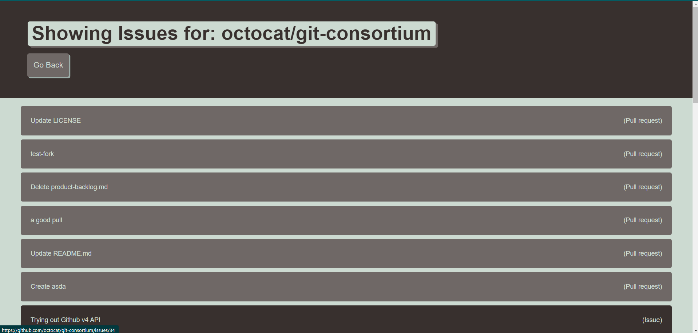

# Git-It-Done

## Description

* Use to search for open issues in GitHub via username search!

* Or choose search for popular "help-wanted" issues based off of your chosen language
  * Available Languages:
    * JavaScript
    * HTML
    * CSS
    

[https://millerchase.github.io/git-it-done/](https://millerchase.github.io/git-it-done/)

